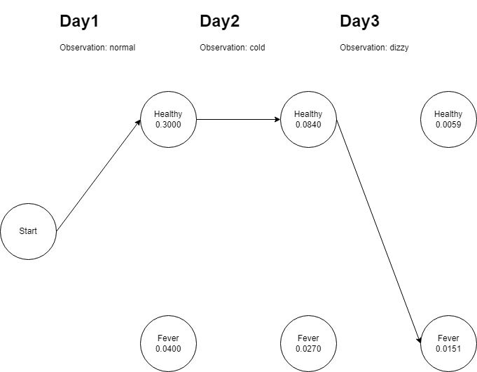

# HMM模型

## 介绍

隐马尔可夫模型（Hidden Markov Model，HMM）是统计模型，用来描述一个含有隐含未知参数的马尔可夫过程。其难点是从可观察的参数中确定该过程的隐含参数。然后利用这些参数来作进一步的分析，例如模式识别。

在正常的马尔可夫模型中，状态对于观察者来说是直接可见的。这样状态的转换概率便是全部的参数。而在隐马尔可夫模型中，状态并不是直接可见的，但受状态影响的某些变量则是可见的。每一个状态在可能输出的符号上都有一概率分布。因此输出符号的序列能够透露出状态序列的一些信息。

隐马尔可夫模型通常解决三种经典问题：

1. 预测：已知模型参数和某一特定的输出序列，求最后时刻各个隐含状态的概率分布。
2. 平滑：已知模型参数和某一特定的输出序列，求中间时刻各个隐含状态的概率分布。
3. 解码：已知模型参数，寻求最可能的能产生某一特定输出序列的隐含状态的序列。

### 什么是马尔可夫过程

在概率论及统计学中，马尔可夫过程（英语：Markov process）是一个具备了马尔可夫性质的随机过程。

一个系统自动的、状态可以完全被观测的马尔可夫过程是马尔科夫链。

### 什么是马尔可夫性质

当一个随机过程在给定现在状态以及所有过去状态的情况下，其未来状态的条件概率分布仅依赖于当前状态。简单来说，在给定现在状态时，它与过去状态是条件独立的，那么此随机过程具有马尔可夫性质。

## 理解

为了方便理解，将隐马模型认为是一个基于时序的概率图模型：

- 在不同的时刻t1和t2，x(t1)和x(t2)用来表示一个隐含的状态，无法被观测者直接观察
- 在不同的时刻t1和t2，y(t1)和y(t2)用来表示一个可观测的状态，可以被观测值直接观察
- y(t)只和x(t)相关
- 受限于马尔可夫性质，x(t)和x(t - 1)有关，x(t - 1)和x(t - 2)有关
- 通常情况下，t的起始被设置为0或1

基于上面几点，可以将隐马模型的状态变迁表现为下图：


再丰富一下这个模型的定义：

- 将x(t)认为是隐含的状态，y(t)认为是可观测的输出
- 认为x(t)的集合为：Q={q1,q2,...,qn}
- 认为y(t)的集合为：V={v1,v2,...,vm}
- 从qi到qj的概率是aij，代表从一个隐含状态到另一个隐含状态的转换概率
- 从qi生成vj的概率是bij，代表从一个隐含状态到一个可见状态的输出概率

## 维特比(Viterbi)算法

维特比算法本身比较好理解，解决的是篱笆型的图最短路径问题：


假设要从S和E中找一条最短路径，如果使用维特比算法，大体上需要经过以下几步：

1. 先从S出发到A，取出三个路线：
   1. S-A1
   2. S-A2
   3. S-A3
2. 从A到B，取出到每个B点最短的路径
   1. 依次判断A1、A2、A3到B1、B2、B3的最短路径
   2. 理论上存在9条路线，由于只取到每个B点的最短路径，所以只有三条，其余路径丢弃
   3. 这里假设剩下的路径是：S-A1-B2、S-A2-B3、S-A3-B1
3. 从B到C，取出到每个C点最短的路径
   1. 和第二点基本一致，假设最后B1-C1、B2-C3、B3-C2最短
   2. 那么最终剩下的路径只有S-A1-B2-C3、S-A2-B3-C2、S-A3-B1-C1
4. 由于E是终点，那么取S-A1-B2-C3-E、S-A2-B3-C2-E、S-A3-B1-C1-E最短的路径即可

理解这个算法后，可以尝试使用这个算法解HMM模型，一个来自[维基百科的例子](https://zh.wikipedia.org/wiki/%E7%BB%B4%E7%89%B9%E6%AF%94%E7%AE%97%E6%B3%95)：

假设一个非常理想化的模型，居民要么健康要么发烧，每天医生问诊一次，居民只能感觉到正常、发冷、头晕，

为了完善隐马模型，我们需要编一些数据：

1. 假定这个区域的居民大体上的健康的，健康人数和发烧人数大致为6:4
2. 健康的居民第二天发烧的概率是0.3，发烧的居民第二天还发烧的概率是0.6
3. 健康的居民有0.5的概率表现正常，0.4的概率表现发冷，0.1的概率表现头晕
4. 发烧的居民有0.1的概率表现正常，0.3的概率表现发冷，0.6的概率表现头晕

根据这些数据和一些我们编的数据，可以构造一个隐马模型如下：


在这个模型中，我们需要求解：当一个居民连续三天的表现分别是：感觉正常，感觉发冷，感觉头晕的时候，居民怎么样的身体状态最有可能？

按照维特比算法的流程，我们需要几个存储结构：

1. 因为我们观测到三天的状态，所以需要一个长度为3的列表，列表中的数据结构是键值对，每个键代表当前天对应的身体状态，值代表是这个身体状态的可能性
2. 一个键值对，由于居民只有两种身体状态，所以键值对的大小为2，存储的是计算到某天的最大的路径

作用到代码上：

```java
@Slf4j
public class HMMTest {
    @Test
    public void test1() {
        // 不能被直接观测的状态，即普通人健康或发烧
        String[] states = new String[]{"Healthy", "Fever"};
        // 可以被直接观测的状态，即普通人感觉正常或发冷或头晕，也是这三天病人的对外表现
        String[] observations = new String[]{"normal", "cold", "dizzy"};
        // 普通人的初始状态的比例，假设健康的概率大
        Map<String, Double> startProbability = new HashMap<String, Double>(2) {{
            put("Healthy", 0.6);
            put("Fever", 0.4);
        }};
        // 转移概率，t时刻的普通人健康或发烧到t + 1时刻的普通人健康或发烧的转移概率
        Map<String, Map<String, Double>> transitionProbability = new HashMap<String, Map<String, Double>>(2) {{
            put("Healthy", new HashMap<String, Double>(2) {{
                put("Healthy", 0.7);
                put("Fever", 0.3);
            }});
            put("Fever", new HashMap<String, Double>(2) {{
                put("Healthy", 0.4);
                put("Fever", 0.6);
            }});
        }};
        // 放射概率，t时刻的普通人健康或发烧展示出的状态的概率
        Map<String, Map<String, Double>> emissionProbability = new HashMap<String, Map<String, Double>>(2) {{
            put("Healthy", new HashMap<String, Double>(3) {{
                put("normal", 0.5);
                put("cold", 0.4);
                put("dizzy", 0.1);
            }});
            put("Fever", new HashMap<String, Double>(3) {{
                put("normal", 0.1);
                put("cold", 0.3);
                put("dizzy", 0.6);
            }});
        }};

        // 病人连续三天看医生，医生发现第一天他感觉正常，第二天感觉冷，第三天感觉头晕。
        // 于是医生产生了一个问题：怎样的健康状态序列最能够解释这些观察结果
        // 说人话就是怎么样发生的概率最大
        viterbi1(observations, states, startProbability, transitionProbability, emissionProbability);
    }

    /**
     * @param observations          全序列内观测到的表现，不一定是全集合
     * @param states                不可被观测的隐含状态的集合，是全集合
     * @param startProbability      不可被观测的隐含状态的集合的起始概率
     * @param transitionProbability 转移概率
     * @param emissionProbability   放射概率
     */
    private void viterbi1(
            String[] observations,
            String[] states,
            Map<String, Double> startProbability,
            Map<String, Map<String, Double>> transitionProbability,
            Map<String, Map<String, Double>> emissionProbability) {
        List<Map<String, Double>> v = new ArrayList<>();
        Map<String, List<String>> path = new HashMap<>(2);

        // 构造初始路径
        v.add(new HashMap<>(2));
        for (String st : states) {
            v.get(0).put(st, startProbability.get(st) * emissionProbability.get(st).get(observations[0]));
            path.put(st, new ArrayList<>());
            path.get(st).add(st);
        }

        for (int t = 1; t < observations.length; t++) {
            v.add(new HashMap<>(2));
            Map<String, List<String>> newPath = new HashMap<>(2);

            for (String currSt : states) {
                double maxDouble = -1.0d;
                String maxSt = "";

                for (String prevSt : states) {
                    double v1 = v.get(t - 1).get(prevSt) * transitionProbability.get(prevSt).get(currSt) * emissionProbability.get(currSt).get(observations[t]);
                    if (v1 > maxDouble) {
                        maxDouble = v1;
                        maxSt = prevSt;
                    }
                }

                v.get(t).put(currSt, maxDouble);
                ArrayList<String> strings = new ArrayList<>(path.get(maxSt));
                strings.add(currSt);
                newPath.put(currSt, strings);
            }

            path = newPath;
        }

        int index = 0;
        for (int i = 0; i < v.size(); i++) {
            if (index == 0) {
                log.info("       " + String.join("  ", states));
            }

            StringBuilder sb = new StringBuilder();
            sb.append(String.format("%4d", i));
            Map<String, Double> step = v.get(i);
            for (String state : states) {
                sb.append(String.format("%8.4f", step.get(state)));
            }

            log.info(sb.toString());
            index++;
        }

        double max = -1.0d;
        String st = "";
        for (String state : states) {
            Double v1 = v.get(v.size() - 1).get(state);
            if (v1 > max) {
                max = v1;
                st = state;
            }
        }

        log.info("{}, {}", max, path.get(st));
    }
}
```

输出为：

```text
      Healthy  Fever
   0  0.3000  0.0400
   1  0.0840  0.0270
   2  0.0059  0.0151

0.01512, [Healthy, Healthy, Fever]
```

所以，如果一个居民满足连续三天的表现分别是：感觉正常，感觉发冷，感觉头晕的时候，居民怎么样的身体状态最有可能是：



## 通过HMM实现中文分词

想将中文分词映射到HMM模型上，需要满足HMM的定义：

- 假定一个句子作为一个序列，句子中的每个字符都是序列中的一个节点，序列的可见结果是每个字符，隐藏序列是每个字符的分词状态
- 隐藏序列的分词状态集包含：
  - B：代表一个词的开始位置
  - M：代表一个词的中间位置
  - E：代表一个词的结束位置
  - S：代表一个字单独成词
- 转移概率：从某个隐藏状态到某个隐藏状态的概率，需要跑数据训练模型才能得到
- 放射概率：从某个隐藏状态到某个可见状态的概率，需要跑数据训练模型才能得到
- 起始矩阵：一个句子开始的第一个字的隐藏状态的概率，通常情况下只能是B或S

现在通过一个例子来看分词的实现，假设现在有个训练好的模型，它的起始矩阵为：{B: 0.8, S: 0.2, M: 0.0, E:0.0}，转移矩阵中的某个结果表示为Aij(i、j取值范围为[B、M、E、S])，放射矩阵的某个结果表示为Bij(i的取值范围为[B、M、E、S]，j的取值范围为训练集中的字符)。

我们假定现在有一个句子：`今天天气好`，按照维特比算法，每个对外展示的状态(即字符)的概率是：`上一个字符的概率/起始概率 * 转移概率[上一个字符的隐藏状态][当前的隐藏状态] * 放射概率[当前的隐藏状态][当前字符]`。在计算出隐藏序列的最大可能顺序后，在E和S代表的序列节点后加空格即可实现分词。

## 通过HMM实现命名实体标注 

和中文分词一样，但是隐藏状态变成了实体标签。