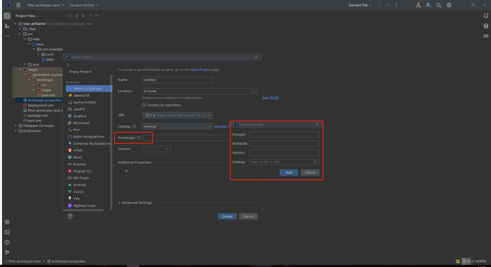

# Guide to Creating Archetypes

## 介绍

简单来说，Archetype(原型/脚手架)是一个Maven项目模板工具包。该系统提供一种生成Maven项目的统一方法，并为用户提供生成这些项目模板的参数化版本。

比较常见的脚手架包括以下几种：

- maven-archetype-quickstart
- maven-archetype-simple
- [spring initializr](https://start.spring.io/)
- [其他](https://maven.apache.org/guides/introduction/introduction-to-archetypes.html#provided-archetypes)

## 基础使用

当需要使用archetype创建一个新项目时，可以使用以下几种方式：

1. 使用idea自带的可视化工具
   
2. 使用命令行
   ```shell
   mvn archetype:generate 
        # 因为我本地的maven配置没改，所以这里需要加一行
        -s D:\apache-maven-3.5.4\conf\setting.xml
        # 想要使用的原型信息，必填
        -DarchetypeGroupId={archeType_groupId}
        # 想要使用的原型信息，必填
        -DarchetypeArtifactId={archeType_artifactId}
        # 想要使用的原型信息，必填
        -DarchetypeVersion={archeType_version}
        # 生成的项目的信息，选填
        # 如果不填，后续会提醒填写，相当于必填
        -DgroupId=
        # 生成的项目的信息，选填
        # 如果不填，后续会提醒填写，相当于必填
        -DartifactId=
        # 原型的maven依赖获取比较特殊，不管本地有没有，都会去远程仓库拉取，耗时较长
        # 这里指定从本地仓库获取
        # 详见：https://stackoverflow.com/questions/17524148/generating-project-in-interactive-mode-taking-lot-of-time
        -DarchetypeCatalog=local
        # 生成的项目的信息，选填
        -Dpackage=
        # 生成的项目的信息，选填
        -Dversion=
        # 根据不同的原型，可能存在其他配置项，见下文
   ```

## 自定义原型

> 创建一个自定义的原型有很多方法，这里只介绍我个人认为比较简单的一种，其他方法本文不提及。

本文介绍的方法是通过一个给定的项目结构反过来生成一个原型。当然直接写一个原型也是一种方法，但是原型的代码结构比较反人类，写起来比较痛苦。

### 创建一个正常的项目

我们以一个flink项目为例，为了适配流水线2.0，新增的flink项目需要满足以下约束：

1. 和pom.xml文件同级的位置，需要一个Deployment.yml文件
2. Deployment.yml文件内部存在一定的格式要求
3. pom.xml中的finalName和mainClass节点强制要求指定
4. pom.xml中的finalName需要和项目名称(artifactId)一致
5. 由于FR 33054 - Flink connector公共库支持流水线环境隔离已经开发完成，flink项目的一部分代码结构将保持一致，所以这部分代码也将纳入原型管理

基于上述约束，生成了一个项目：flink-archetype-md-test：

```shell
D:\CODE\FLINK-ARCHETYPE-MD-TEST
│  Deployment.yml
│  package.xml
│  pom.xml
│
└─src
    ├─main
    │  ├─java
    │  │  └─com
    │  │      └─example
    │  │          │  Main.java
    │  │          │  PROPERTYJobNameJob.java
    │  │          │
    │  │          └─conf
    │  │                  ConfJob.java
    │  │
    │  └─resources
    │          application-middleware.yml
    │          conf-env.yml
    │          conf-job.yml
    │
    └─test
```

其他文件不重要，主要是看一下pom.xml：

```xml
<?xml version="1.0" encoding="UTF-8"?>

<project xmlns="http://maven.apache.org/POM/4.0.0" xmlns:xsi="http://www.w3.org/2001/XMLSchema-instance"
         xsi:schemaLocation="http://maven.apache.org/POM/4.0.0 http://maven.apache.org/xsd/maven-4.0.0.xsd">
    <modelVersion>4.0.0</modelVersion>

    <groupId>flink-archetype-md-test</groupId>
    <artifactId>test-artifactId</artifactId>
    <version>1.0.0</version>

    <properties>
        <project.build.sourceEncoding>UTF-8</project.build.sourceEncoding>
        <maven.compiler.source>1.8</maven.compiler.source>
        <maven.compiler.target>1.8</maven.compiler.target>
    </properties>

    <dependencies>
        <dependency>
            <groupId>com.hillstonenet.cloud</groupId>
            <artifactId>cloud-middleware-flink_2.12-1.14_config</artifactId>
            <version>1.0.0-SNAPSHOT</version>
        </dependency>
    </dependencies>

    <build>
        <finalName>${artifactId}</finalName>
        <plugins>
            <plugin>
                <!-- 这个插件的作用是将项目反向生成原型 -->
                <groupId>org.apache.maven.plugins</groupId>
                <artifactId>maven-archetype-plugin</artifactId>
                <version>3.1.1</version>
                <configuration>
                    <propertyFile>archetype.properties</propertyFile>
                    <encoding>UTF-8</encoding>
                    <!-- 这个插件的作用是将项目反向生成原型 -->
                    <archetypeFilteredExtentions>java,xml,yml,yaml</archetypeFilteredExtentions>
                </configuration>
            </plugin>
            <plugin>
                <groupId>org.apache.maven.plugins</groupId>
                <artifactId>maven-assembly-plugin</artifactId>
                <version>3.3.0</version>
                <configuration>
                    <appendAssemblyId>false</appendAssemblyId>
                    <descriptorRefs>
                        <descriptorRef>jar-with-dependencies</descriptorRef>
                    </descriptorRefs>
                    <descriptors>
                        <descriptor>${project.basedir}/package.xml</descriptor>
                    </descriptors>
                    <archive>
                        <manifest>
                            <mainClass>${package}.Main</mainClass>
                        </manifest>
                    </archive>
                </configuration>
                <executions>
                    <execution>
                        <id>make-assembly</id>
                        <phase>package</phase>
                        <goals>
                            <goal>single</goal>
                        </goals>
                    </execution>
                </executions>
            </plugin>
        </plugins>
    </build>
</project>

```

到此为止，一个基础的flink项目已经准备完成。

### 原型结构

> 在修改上述的项目之前，需要对原型的结构有一些的了解。

一个原型应该包含如下几个部分：

1. 原型元数据文件(archetype descriptor)
2. 原型自身的pom
3. 需要复制的一系列文件结构
4. 新建项目的pom

#### 原型元数据文件

> archetype descriptor是原型的核心，用于指定如何将复制文件、如何替换占位符等

archetype descriptor的详细介绍可以看：[ArchetypeDescriptor](https://maven.apache.org/archetype/archetype-models/archetype-descriptor/archetype-descriptor.html)

在本小节不做赘述，例子见下文

#### 原型自身的pom

> 包括原型的groupId、artifactId等信息

比较直观，无描述

#### 需要复制的一系列文件结构

> 指的是一系列需要被直接复制到新项目的文件、以及这些文件中需要修改的占位符

比较直观，无描述

#### 新建项目的pom

> 指的是新建项目的pom，其中的部分字段也可以通过占位符的方式修改

比较直观，无描述

### 修改项目

针对不同的flink项目，一部分配置是不同的：

- groupId
- artifactId
- version 
  
上面这三点无需我们考虑，archetype会自动通过占位符替换。

****- finalName：直接指定${artifactId}即可
- package
- displayName(Deployment.yml)
- name(Deployment.yml)
- namespace(Deployment.yml)
- deploymentTargetName(Deployment.yml)
- log.path(Deployment.yml)
- cpu/memory(Deployment.yml)

为了解决占位符替换的问题，需要新建一个文件和pom同级：archetype.properties(这个文件在pom中指定过)。

```properties
package=com.example
```

解释一下这一行的意思：

上文出现过，在这个demo项目中，指定的package是com.example，这就代表着archetype插件会将所有'com.example'替换为'${package}'，这里是将右边的值替换为左边的占位符，有点反直觉。

举例说明：

在src/main/com/example/conf/ConfJob.java中，本来应该是：

```java
package com.example.conf;
```

会被替换为：

```java
package ${package}.conf;
```

在这个基础上，我们将Deployment.yml修改为：

```yaml
# 未修改的配置省略
metadata:
    displayName: test-artifactId
    name: test-artifactId
    namespace: PROPERTY_NAMESPACE
spec:
    deploymentTargetName: PROPERTY_NAMESPACE
    template:
        spec:
            resources:
                jobmanager:
                    cpu: PROPERTY_CPU
                    memory: PROPERTY_MEMORY
                taskmanager:
                    cpu: PROPERTY_CPU
                    memory: PROPERTY_MEMORY
            kubernetes:
                jobManagerPodTemplate:
                    spec:
                        volumes:
                           - hostPath:
                                path:  /var/log/hillstone/PROPERTY_MAIN_PROJECT/flink/job-manager/test-artifactId
                taskManagerPodTemplate:
                    spec:
                        volumes:
                           - hostPath:
                                path:  /var/log/hillstone/PROPERTY_MAIN_PROJECT/flink/task-manager/test-artifactId
```

将archetype.properties文件修改为：

```properties
namespace=PROPERTY_NAMESPACE
package=com.example
artifactId=test-artifactId
parentProject=PROPERTY_MAIN_PROJECT
cpu=PROPERTY_CPU
memory=PROPERTY_MEMORY
jobName=PROPERTYJobName
```

在该项目下，执行maven命令：

```shell
mvn archetype:create-from-project
    -s D:\apache-maven-3.5.4\conf\setting.xml 
```

项目生成的target下，需要我们关注的有：

- generated-sources/archetype/pom.xml
- generated-sources/archetype/src/main/resources/META-INF/maven/archetype-metadata.xml
- generated-sources/archetype/src/main/resources/archetype-resources/pom.xml

首先查看generated-sources/archetype/pom.xml，这个文件是这个原型自身的pom，其中可以修改groupId、version等信息。

然后是generated-sources/archetype/src/main/resources/archetype-resources/pom.xml，这个文件是新项目的pom文件，可以删除掉maven-archetype-plugin。

最后是generated-sources/archetype/src/main/resources/META-INF/maven/archetype-metadata.xml，这文件是最重要的文件，所以放在这里说明。

#### archetype-metadata.xml

> 这个文件就是原型的元数据描述文件。

这个文件包含三部分的信息：

- 从原型生成项目需要的参数：requiredProperties
- 原型中的文件如何被archetype插件复制到新项目，以及占位符的替换：fileSets
- module情况(目前不考虑)：modules

##### requiredProperties

在这里定义的property是创建新项目需要使用的参数，如果使用了defaultValue，那么就不是强制要求传入。可以根据需求来。

##### fileSets

这里标记的文件都会被复制到新的项目中，需要删除一部分idea自带的文件。

#### 创建原型jar包

在调整好所有文件后，进入target\generated-sources\archetype目录下，执行：

```shell
mvn -s D:\apache-maven-3.5.4\conf\setting.xml install        
```

## 附录：创建一个springboot的原型

### 第一步：创建一个正常的spring boot项目

假定这个spring boot项目为：spring-boot-archetype-test，并按照上面的流程修改项目和配置文件，一个最终的spring boot大致为：

```shell
D:\CODE\SPRING-BOOT-ARCHETYPE-TEST
│  archetype.properties
│  pom.xml
│
└─src
    ├─main
    │  ├─chart
    │  │  └─PROPERTY_ARTIFACT_ID
    │  │      │  .helmignore
    │  │      │  Chart.yaml
    │  │      │  values.yaml
    │  │      │
    │  │      ├─charts
    │  │      └─templates
    │  │          │  deployment.yaml
    │  │          │  NOTES.txt
    │  │          │  service.yaml
    │  │          │  servicemesh.yaml
    │  │          │  _helpers.tpl
    │  │          │
    │  │          └─tests
    │  │                  test-connection.yaml
    │  │
    │  ├─docker
    │  │      Dockerfile
    │  │
    │  ├─java
    │  │  └─com
    │  │      └─example
    │  │              SpringApplicationNameApplication.java
    │  │
    │  └─resources
    │          application-beta.yml
    │          application-china.yml
    │          application-common.yml
    │          application-dev.yml
    │          application-env.yml
    │          application-eu.yml
    │          application-middleware.yml
    │          application-pro.yml
    │          application-test.yml
    │          application-usa.yml
    │          application.yml
    │          I18N_CLOUD_ERROR_MSG_en.properties
    │          I18N_CLOUD_ERROR_MSG_zh_CN.properties
    │          I18N_CLOUD_LOG_MSG_en.properties
    │          I18N_CLOUD_LOG_MSG_zh_CN.properties
    │          logback-spring.xml
    │
    └─test
        └─java
            └─com
                └─example
                        SpringApplicationNameApplicationTests.java
```

经过修改的archetype.properties文件如下：

```properties
# 部署到k8s的namespace
namespace=PROPERTY_CHART_NAMESPACE
# helm部署配置中的一些name之类的
artifactId=PROPERTY_ARTIFACT_ID
# 探针地址、spring服务接口前缀
contextPath=PROPERTY_CONTEXT_PATH
# 端口
serverPort=PROPERTY_SERVER_PORT
# ngcv tip等日志地址
logParentProject=PROPERTY_LOG_PARENT_PROJECT
# Application.java的名字
springName=SpringApplicationName
# 包名
package=com.example
# parent信息
parentGroupId=PROPERTY_PARENT_GROUP_ID
parentArtifactId=PROPERTY_PARENT_ARTIFACT_ID
parentVersion=PROPERTY_PARENT_VERSION
```


