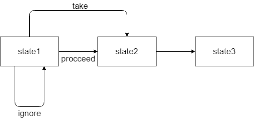

# Flink CEP 复杂事件处理

Flink CEP是在Flink上层实现的复杂事件处理库。 它可以让你在无限事件流中检测出特定的事件模型，有机会掌握数据中重要的那部分。

Flink CEP需要在pom中添加CEP依赖：

```xml
 <dependency>
     <groupId>org.apache.flink</groupId>
     <artifactId>flink-cep_2.12</artifactId>
     <version>...</version>
 </dependency>
```

还有一点，如果需要对事件进行比较和匹配的话，**CEP需要对类型实现equals()和hashCode()方法**。

CEP支持从输入流中抽取复杂的模式序列，一个模式序列包含许多模式Pattern，**每个模式必须有独一无二的名字**。

```java
public class Pattern<T, F extends T> {
    private final String name;
    private final Pattern<T, ? extends T> previous;
    //用户定义的条件，遍历模式先前接受的元素(可选)，决定是否接受新的元素
    private IterativeCondition<F> condition;
    //定义最大间隔，从匹配的第一个事件开始。超出时间的将被舍弃
    private Time windowTime;
    //描述模式的量词，有三种，包括single、looping、times
    private Quantifier quantifier;
    //用户定义的条件，遍历模式先前接受的元素(可选)，决定是否结束。只能在looping下可用
    private IterativeCondition<F> untilCondition;
    //定义该模式可能发生的次数
    private Times times;
    //定义匹配过程后的跳转策略
    private final AfterMatchSkipStrategy afterMatchSkipStrategy;
    ...
}
```

## CEP demo

> 以下代码来自官网
> <https://nightlies.apache.org/flink/flink-docs-release-1.14/docs/libs/cep/>

```java
DataStream<Event> input = ...

//从begin开始一个新的模式序列，提供的名称"start"为该序列的初始模式之一，设置事件序列的基本类型
//where指定了一个条件，当事件满足该条件才能被视为匹配；多个条件中，where相当与逻辑和AND
//next将新的模式添加到现有模式，next指定的模式强制严格时间连续，两个匹配的事件之间不存在其他事件
//subType表示对当前的模式应用子类型约束，给定的事件必须是给定的类型才能匹配
//followedBy将新模式添加到现有模式，followedBy指定的模式强制执行非严格的时间连续性，两个匹配的事件之间可能有被忽略的事件
Pattern<Event, ?> pattern = Pattern.<Event>begin("start").where(
        new SimpleCondition<Event>() {
            @Override
            public boolean filter(Event event) {
                return event.getId() == 42;
            }
        }
    ).next("middle").subtype(SubEvent.class).where(
        new SimpleCondition<SubEvent>() {
            @Override
            public boolean filter(SubEvent subEvent) {
                return subEvent.getVolume() >= 10.0;
            }
        }
    ).followedBy("end").where(
         new SimpleCondition<Event>() {
            @Override
            public boolean filter(Event event) {
                return event.getName().equals("end");
            }
         }
    );

//通过CEP API创建一个模式流
PatternStream<Event> patternStream = CEP.pattern(input, pattern);

DataStream<Alert> result = patternStream.process(
    new PatternProcessFunction<Event, Alert>() {
        @Override
        public void processMatch(
                Map<String, List<Event>> pattern,
                Context ctx,
                Collector<Alert> out) throws Exception {
            out.collect(createAlertFrom(pattern));
        }
    });
```

在该代码块中，注意从1.11（大概）之后，需要在CEP.pattern(DataStream\<T>, Pattern<T, ?>)后明确事件时间inEventTime()还是处理时间inProcessingTime()，默认情况下，执行的是事件时间。

## CEP 原理讲解

### NFA 非确定的有穷状态机



NFA状态：

```java
/** Set of actions when doing a state transition from a {@link State} to another. */
/** 从一个状态到另一个状态进行状态转化时的一组动作。 */
public enum StateTransitionAction {
    TAKE, // take the current event and assign it to the current state
    IGNORE, // ignore the current event
    PROCEED // do the state transition and keep the current event for further processing (epsilon
    // transition)
}

public enum StateType {
    Start, // the state is a starting state for the NFA
    Final, // the state is a final state for the NFA
    Normal, // the state is neither a start nor a final state
    Stop
}
```

NFAFactory的创建：

```java
public class NFACompiler {
    void compileFactory() {
            //最后一个模式不能以NOT_FOLLOW结束
            if (currentPattern.getQuantifier().getConsumingStrategy()
                    == Quantifier.ConsumingStrategy.NOT_FOLLOW) {
                throw new MalformedPatternException(
                        "NotFollowedBy is not supported as a last part of a Pattern!");
            }
   
            //通过Set检查是否存在重复模式名
            checkPatternNameUniqueness();

            //匹配后跳过策略不能重名
            checkPatternSkipStrategy();

            // we're traversing the pattern from the end to the beginning --> the first state is the
            // final state
            State<T> sinkState = createEndingState();
            // add all the normal states
            sinkState = createMiddleStates(sinkState);
            // add the beginning state
            createStartState(sinkState);
    }
        
    //为NFA创建一个终极态
    private State<T> createEndingState() {
        //ENDING_STATE_NAME = $endState$，生成一个State并加入states
        State<T> endState = createState(ENDING_STATE_NAME, State.StateType.Final);
        //null
        windowTime =
              Optional.ofNullable(currentPattern.getWindowTime()).map(Time::toMilliseconds);
        return endState;
   }

   //将start和final之间的状态加入states，传入参数为final state
   private State<T> createMiddleStates(final State<T> sinkState) {
       State<T> lastSink = sinkState;
       while (currentPattern.getPrevious() != null) {
           if (currentPattern.getQuantifier().getConsumingStrategy()
               == Quantifier.ConsumingStrategy.NOT_FOLLOW) {
               // do nothing
               // skip notFollow patterns, they are converted into edge conditions
           } else if (currentPattern.getQuantifier().getConsumingStrategy()
                      == Quantifier.ConsumingStrategy.NOT_NEXT) {
               // 待补充
           } else {
               // 判断当前模式使用的量词是否使用looping或者times
               // 完善take condition 和 ignore confition
               // 将normal状态的模式生成state，将take condition加入state；
               // 将proceed condition加入state
               // 将ignore condition加入state
               lastSink = convertPattern(lastSink);
           }
           
           followingPattern = currentPattern;
           currentPattern = currentPattern.getPrevious();
           
           final Time currentWindowTime = currentPattern.getWindowTime();
           if (currentWindowTime != null
               && currentWindowTime.toMilliseconds() < windowTime.orElse(Long.MAX_VALUE)) {
               // the window time is the global minimum of all window times of each state
               windowTime = Optional.of(currentWindowTime.toMilliseconds());
           }
       }
       return lastSink;
   }
}
```

NFA的创建在CepOperator#open()中:

```java
 public void open() throws Exception {
        super.open();
        timerService =
                getInternalTimerService(
                        "watermark-callbacks", VoidNamespaceSerializer.INSTANCE, this);

        nfa = nfaFactory.createNFA();
        nfa.open(cepRuntimeContext, new Configuration());

        context = new ContextFunctionImpl();
        collector = new TimestampedCollector<>(output);
        cepTimerService = new TimerServiceImpl();

        // metrics
        this.numLateRecordsDropped = metrics.counter(LATE_ELEMENTS_DROPPED_METRIC_NAME);
    }
    
    public NFA<T> createNFA() {
     return new NFA<>(states, windowTime, timeoutHandling);
    }
```

随后，用户定义的模式序列中的每个模式都会以键值对的形式存入map，key为用户定义的name，这也是name不能重复的原因。值得注意的是，编译过程中会自动生成一个终极态，name为$endState$。

```java
    //NFA.class
 private Map<String, State<T>> loadStates(final Collection<State<T>> validStates) {
        //以各个模式的name做key，无法重名
        Map<String, State<T>> tmp = new HashMap<>(4);
        for (State<T> state : validStates) {
            tmp.put(state.getName(), state);
        }
        return Collections.unmodifiableMap(tmp);
    }
 
 //CepOperator.class
 public void open(RuntimeContext cepRuntimeContext, Configuration conf) throws Exception {
        for (State<T> state : getStates()) {
            for (StateTransition<T> transition : state.getStateTransitions()) {
                //将各个组件的条件提取
                IterativeCondition condition = transition.getCondition();
                //如果是RichFunction的子类，将运行时上下文赋给func
                FunctionUtils.setFunctionRuntimeContext(condition, cepRuntimeContext);
                //如果是RichFuntion的子类，执行func的open()
                FunctionUtils.openFunction(condition, conf);
            }
        }
    }
```

## 量词的使用

```java
/**
 量词的作用是描述模式。量词有三种主要的分类：1、single 2、looping 3、times
*/
public class Quantifier {
    //该量词具备的属性
    private final EnumSet<QuantifierProperty> properties;
    //该量词的匹配策略
    private final ConsumingStrategy consumingStrategy;
    private ConsumingStrategy innerConsumingStrategy = ConsumingStrategy.SKIP_TILL_NEXT;
 ...
    public static class Times {
        private final int from;
        private final int to;

        private Times(int from, int to) {
            Preconditions.checkArgument(
                    from > 0, "The from should be a positive number greater than 0.");
            Preconditions.checkArgument(
                    to >= from,
                    "The to should be a number greater than or equal to from: " + from + ".");
            this.from = from;
            this.to = to;
        }

        public int getFrom() {
            return from;
        }

        public int getTo() {
            return to;
        }

        public static Times of(int from, int to) {
            return new Times(from, to);
        }

        public static Times of(int times) {
            return new Times(times, times);
        }

        @Override
        public boolean equals(Object o) {
            if (this == o) {
                return true;
            }
            if (o == null || getClass() != o.getClass()) {
                return false;
            }
            Times times = (Times) o;
            return from == times.from && to == times.to;
        }

        @Override
        public int hashCode() {
            return Objects.hash(from, to);
        }
    }
    
    //描述一个量词可能具有的属性，并非全部生效
    public enum QuantifierProperty {
        SINGLE,
        LOOPING,
        TIMES,
        OPTIONAL,
        GREEDY
    }
    
    //描述在模式中匹配事件的策略
    //具体的调用逻辑在NFACompiler.class中getIgnoreCondition()
    public enum ConsumingStrategy {
        //ignoreCondition = null;
        STRICT,
        //ignoreCondition = new RichNotCondition<>((IterativeCondition<T>) pattern.getCondition());
        SKIP_TILL_NEXT,
        //ignoreCondition = BooleanConditions.trueFunction();
        SKIP_TILL_ANY,

        NOT_FOLLOW,
        NOT_NEXT
    }
    ...
}

public class Pattern<T, F extends T> {
 ...
    //指定该模式应匹配的确切次数
 public Pattern<T, F> times(int times) {
        checkIfNoNotPattern();
        checkIfQuantifierApplied();
        Preconditions.checkArgument(times > 0, "You should give a positive number greater than 0.");
        this.quantifier = Quantifier.times(quantifier.getConsumingStrategy());
        this.times = Times.of(times);
        return this;
    }
    
    //指定模式在from到to之间出现
    public Pattern<T, F> times(int from, int to) {
        checkIfNoNotPattern();
        checkIfQuantifierApplied();
        this.quantifier = Quantifier.times(quantifier.getConsumingStrategy());
        if (from == 0) {
            this.quantifier.optional();
            from = 1;
        }
        this.times = Times.of(from, to);
        return this;
    }
    
    //指定此模式对于匹配是可选的，即可以出现0次
    public Pattern<T, F> optional() {
        checkIfPreviousPatternGreedy();
        quantifier.optional();
        return this;
    }
    
    //指定模式尽可能多出现，尽可能多的事件和此模式匹配
    public Pattern<T, F> greedy() {
        checkIfNoNotPattern();
        checkIfNoGroupPattern();
        this.quantifier.greedy();
        return this;
    }
    
    //此模式可以出现一次或多次
    public Pattern<T, F> oneOrMore() {
        checkIfNoNotPattern();
        checkIfQuantifierApplied();
        this.quantifier = Quantifier.looping(quantifier.getConsumingStrategy());
        this.times = Times.of(1);
        return this;
    }
    
    //指定此模式至少出现的次数
    public Pattern<T, F> timesOrMore(int times) {
        checkIfNoNotPattern();
        checkIfQuantifierApplied();
        this.quantifier = Quantifier.looping(quantifier.getConsumingStrategy());
        this.times = Times.of(times);
        return this;
    }
 ...
}
```

## 模式的使用

Flink CEP对组合起来的模式序列有三种连续策略：

- 严格连续：希望所有匹配的事件严格的一个一个出现，中间没有任何不匹配

- 松散连续：忽略匹配的事件中不匹配的事件

- 不确定的松散连续：允许忽略掉一些匹配事件的附加匹配

举例来说，对于数据流(a，c，b1，b2)有模式序列(a，b)，

- 严格连续：{}
- 松散连续：{a，b1}
- 不确定的松散连续：{a，b1}，{a，b2}

```java
public class Pattern<T, F extends T> {
 ...
    //初始模式作为开头
 public static <X> Pattern<X, X> begin(final String name) {
        return new Pattern<>(name, null, ConsumingStrategy.STRICT, AfterMatchSkipStrategy.noSkip());
    }
    
    public static <X> Pattern<X, X> begin(
            final String name, final AfterMatchSkipStrategy afterMatchSkipStrategy) {
        return new Pattern<X, X>(name, null, ConsumingStrategy.STRICT, afterMatchSkipStrategy);
    }
    
    //为当前模式定义一个条件，为了匹配这个模式，一个事件必须满足某些条件
    public Pattern<T, F> where(IterativeCondition<F> condition) {
        Preconditions.checkNotNull(condition, "The condition cannot be null.");

        ClosureCleaner.clean(condition, ExecutionConfig.ClosureCleanerLevel.RECURSIVE, true);
        if (this.condition == null) {
            this.condition = condition;
        } else {
            this.condition = new RichAndCondition<>(this.condition, condition);
        }
        return this;
    }
    
    //增加一个判断条件和当前判断条件取或
    public Pattern<T, F> or(IterativeCondition<F> condition) {
        Preconditions.checkNotNull(condition, "The condition cannot be null.");

        ClosureCleaner.clean(condition, ExecutionConfig.ClosureCleanerLevel.RECURSIVE, true);

        if (this.condition == null) {
            this.condition = condition;
        } else {
            this.condition = new RichOrCondition<>(this.condition, condition);
        }
        return this;
    }
    
    //为当前模式定义一个子类型条件，一个事件是这个子类型的时候才会匹配这个条件
    public <S extends F> Pattern<T, S> subtype(final Class<S> subtypeClass) {
        Preconditions.checkNotNull(subtypeClass, "The class cannot be null.");

        if (condition == null) {
            this.condition = new SubtypeCondition<F>(subtypeClass);
        } else {
            this.condition =
                    new RichAndCondition<>(condition, new SubtypeCondition<F>(subtypeClass));
        }

        @SuppressWarnings("unchecked")
        Pattern<T, S> result = (Pattern<T, S>) this;

        return result;
    }
    
    //为循环模式定一个结束条件，当满足了给定的条件的事件出现后，就不会再有新的事件被接受进入模式了。只适用于oneOrMore()
    public Pattern<T, F> until(IterativeCondition<F> untilCondition) {
        Preconditions.checkNotNull(untilCondition, "The condition cannot be null");

        if (this.untilCondition != null) {
            throw new MalformedPatternException("Only one until condition can be applied.");
        }

        if (!quantifier.hasProperty(Quantifier.QuantifierProperty.LOOPING)) {
            throw new MalformedPatternException(
                    "The until condition is only applicable to looping states.");
        }

        ClosureCleaner.clean(untilCondition, ExecutionConfig.ClosureCleanerLevel.RECURSIVE, true);
        this.untilCondition = untilCondition;

        return this;
    }
    
    //指定一个模式应该在某段时间内发生，一个模式只能有一个时间限制，如果限制了多个时间，会使用最小的
    public Pattern<T, F> within(Time windowTime) {
        if (windowTime != null) {
            this.windowTime = windowTime;
        }

        return this;
    }
    
    //严格连续
    public Pattern<T, T> next(final String name) {
        return new Pattern<>(name, this, ConsumingStrategy.STRICT, afterMatchSkipStrategy);
    }
    
    //不希望直接连着一个特定事件
    public Pattern<T, T> notNext(final String name) {
        if (quantifier.hasProperty(Quantifier.QuantifierProperty.OPTIONAL)) {
            throw new UnsupportedOperationException(
                    "Specifying a pattern with an optional path to NOT condition is not supported yet. "
                            + "You can simulate such pattern with two independent patterns, one with and the other without "
                            + "the optional part.");
        }
        return new Pattern<>(name, this, ConsumingStrategy.NOT_NEXT, afterMatchSkipStrategy);
    }
    
    //松散连续
    public Pattern<T, T> followedBy(final String name) {
        return new Pattern<>(name, this, ConsumingStrategy.SKIP_TILL_NEXT, afterMatchSkipStrategy);
    }
    
    //不希望特定事件发生再两个事件之间，不能作为结尾
    public Pattern<T, T> notFollowedBy(final String name) {
        if (quantifier.hasProperty(Quantifier.QuantifierProperty.OPTIONAL)) {
            throw new UnsupportedOperationException(
                    "Specifying a pattern with an optional path to NOT condition is not supported yet. "
                            + "You can simulate such pattern with two independent patterns, one with and the other without "
                            + "the optional part.");
        }
        return new Pattern<>(name, this, ConsumingStrategy.NOT_FOLLOW, afterMatchSkipStrategy);
    }
    
    //不确定的松散连续
    public Pattern<T, T> followedByAny(final String name) {
        return new Pattern<>(name, this, ConsumingStrategy.SKIP_TILL_ANY, afterMatchSkipStrategy);
    }
 ...
}
```

## 条件 IterativeCondition

指定判断事件属性的条件可以通过where、or、until等方法。

在实现复杂的过滤时，使用IterativeCondition。比较简单的过滤条件可以用SimpleCondition。

```java
public abstract class IterativeCondition<T> implements Function, Serializable {
    private static final long serialVersionUID = 7067817235759351255L;

    public IterativeCondition() {
    }

    public abstract boolean filter(T var1, IterativeCondition.Context<T> var2) throws Exception;

    public interface Context<T> extends TimeContext {
        Iterable<T> getEventsForPattern(String var1) throws Exception;
    }
}

//使用SimpleCondition的时候，无法访问模式中先前接受的元素
public abstract class SimpleCondition<T> extends IterativeCondition<T> implements FilterFunction<T> {
    private static final long serialVersionUID = 4942618239408140245L;

    public SimpleCondition() {
    }

    public boolean filter(T value, Context<T> ctx) throws Exception {
        return this.filter(value);
    }
}
```

## 扩展 Quantifier

```java
public class Quantifier {
 ...
 public static Quantifier one(Quantifier.ConsumingStrategy consumingStrategy) {
        return new Quantifier(
            consumingStrategy, Quantifier.QuantifierProperty.SINGLE, new Quantifier.QuantifierProperty[0]
        );
    }

    public static Quantifier looping(Quantifier.ConsumingStrategy consumingStrategy) {
        return new Quantifier(
            consumingStrategy, Quantifier.QuantifierProperty.LOOPING, new Quantifier.QuantifierProperty[0]
        );
    }

    public static Quantifier times(Quantifier.ConsumingStrategy consumingStrategy) {
        return new Quantifier(
            consumingStrategy, Quantifier.QuantifierProperty.TIMES, new Quantifier.QuantifierProperty[0]
        );
    }
 ...
    public static enum QuantifierProperty {
        SINGLE,
        LOOPING,
        TIMES,
        OPTIONAL,
        GREEDY;

        private QuantifierProperty() {
        }
    }
}
```

## NFA的运作逻辑

首先，CEP也被认为是算子的一种，具体可见org.apache.flink.cep.operator.CepOperator。\
和一般的算子一样，都实现了processElement(StreamRecord\<IN> element)方法。

```java
public class CepOperator<IN, KEY, OUT> {
    public void processElement(StreamRecord<IN> element) throws Exception {
        if (isProcessingTime) {
            if (comparator == null) {
                // 当不存在指定的排序器时，需要确认不乱序
            } else {
                // 逻辑和事件时间类似，但是最后指定一个当前处理时间+1的定时器用于排序和提交
                // 执行bufferEvent(IN event, long currentTime)，currentTime是当前处理时间
            }
        } else {
            // 事件时间的处理需要考虑水印的影响，当超过水印的元素需要丢弃
            // 同时，以当前水印+1注册一个定时器，这个定时任务的作用是
            // 执行bufferEvent(IN event, long currentTime)，currentTime是当前事件事件时间
        }
    }

    private void bufferEvent(IN event, long currentTime) throws Exception {
        List<IN> elementsForTimestamp = elementQueueState.get(currentTime);
        if (elementsForTimestamp == null) {
            elementsForTimestamp = new ArrayList<>();
        }

        elementsForTimestamp.add(event);
        elementQueueState.put(currentTime, elementsForTimestamp);
    }

    @Override
    public void onProcessingTime(InternalTimer<KEY, VoidNamespace> timer) throws Exception {
        // 1) get the queue of pending elements for the key and the corresponding NFA,
        // 2) process the pending elements in process time order and custom comparator if exists by feeding them in the NFA
        // 3) update the stored state for the key, by only storing the new NFA and MapState iff they have state to be used later.

        // STEP 1
        // 从elementQueueState获取时间戳
        PriorityQueue<Long> sortedTimestamps = getSortedTimestamps();
        NFAState nfa = getNFAState();

        // STEP 2
        while (!sortedTimestamps.isEmpty()) {
            long timestamp = sortedTimestamps.poll();
            advanceTime(nfa, timestamp);
            try (Stream<IN> elements = sort(elementQueueState.get(timestamp))) {
                elements.forEachOrdered(
                        event -> {
                            try {
                                processEvent(nfa, event, timestamp);
                            } catch (Exception e) {
                                throw new RuntimeException(e);
                            }
                        });
            }
            elementQueueState.remove(timestamp);
        }

        // STEP 3
        updateNFA(nfa);
    }
}
```

## 扩展 AfterMatchSkipStrategy

```java
public class NoSkipStrategy extends AfterMatchSkipStrategy {

    private static final long serialVersionUID = -5843740153729531775L;

    static final NoSkipStrategy INSTANCE = new NoSkipStrategy();

    private NoSkipStrategy() {}

    @Override
    //仅有no_skip返回false，表示不跳过
    public boolean isSkipStrategy() {
        return false;
    }

    @Override
    protected boolean shouldPrune(EventId startEventID, EventId pruningId) {
        throw new IllegalStateException("This should never happen. Please file a bug.");
    }

    @Override
    protected EventId getPruningId(Collection<Map<String, List<EventId>>> match) {
        throw new IllegalStateException("This should never happen. Please file a bug.");
    }

    @Override
    public String toString() {
        return "NoSkipStrategy{}";
    }
}

public final class SkipToNextStrategy extends SkipRelativeToWholeMatchStrategy {

    public static final SkipToNextStrategy INSTANCE = new SkipToNextStrategy();

    private static final long serialVersionUID = -6490314998588752621L;

    private SkipToNextStrategy() {}

    @Override
    protected EventId getPruningId(final Collection<Map<String, List<EventId>>> match) {
        EventId pruningId = null;
        for (Map<String, List<EventId>> resultMap : match) {
            for (List<EventId> eventList : resultMap.values()) {
                pruningId = min(pruningId, eventList.get(0));
            }
        }

        return pruningId;
    }

    @Override
    public String toString() {
        return "SkipToNextStrategy{}";
    }
}

public final class SkipPastLastStrategy extends SkipRelativeToWholeMatchStrategy {

    public static final SkipPastLastStrategy INSTANCE = new SkipPastLastStrategy();

    private static final long serialVersionUID = -8450320065949093169L;

    private SkipPastLastStrategy() {}

    @Override
    protected EventId getPruningId(final Collection<Map<String, List<EventId>>> match) {
        EventId pruningId = null;
        for (Map<String, List<EventId>> resultMap : match) {
            for (List<EventId> eventList : resultMap.values()) {
                pruningId = max(pruningId, eventList.get(eventList.size() - 1));
            }
        }

        return pruningId;
    }

    @Override
    public String toString() {
        return "SkipPastLastStrategy{}";
    }
}

public final class SkipToLastStrategy extends SkipToElementStrategy {
    private static final long serialVersionUID = 7585116990619594531L;

    SkipToLastStrategy(String patternName, boolean shouldThrowException) {
        super(patternName, shouldThrowException);
    }

    @Override
    public SkipToElementStrategy throwExceptionOnMiss() {
        return new SkipToLastStrategy(getPatternName().get(), true);
    }

    @Override
    int getIndex(int size) {
        return size - 1;
    }

    @Override
    public String toString() {
        return "SkipToLastStrategy{" + "patternName='" + getPatternName().get() + '\'' + '}';
    }
}

public final class SkipToFirstStrategy extends SkipToElementStrategy {
    private static final long serialVersionUID = 7127107527654629026L;

    SkipToFirstStrategy(String patternName, boolean shouldThrowException) {
        super(patternName, shouldThrowException);
    }

    @Override
    public SkipToElementStrategy throwExceptionOnMiss() {
        return new SkipToFirstStrategy(getPatternName().get(), true);
    }

    @Override
    int getIndex(int size) {
        return 0;
    }

    @Override
    public String toString() {
        return "SkipToFirstStrategy{" + "patternName='" + getPatternName().get() + '\'' + '}';
    }
}
```
