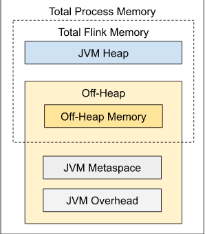
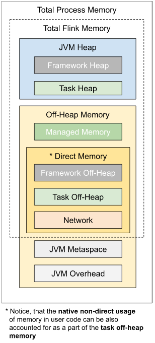
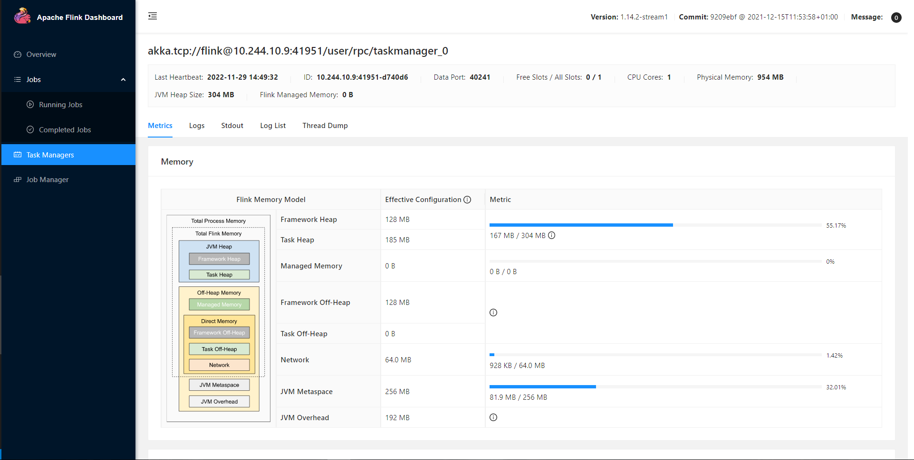

# Flink 内存模型和管理

注：本文基于1.14

## 内存模型和配置

### 内存模型

参考：

> <https://nightlies.apache.org/flink/flink-docs-release-1.14/docs/deployment/memory/mem_setup/>

Flink JVM的内存总量包括Flink自身消耗的内存和运行进程消耗的JVM内存，FLink自身的内存又包括JVM Heap(堆内存)和Off-heap(对外内存)内存。\
即：

$TotalFlinkMemory = JVMHeap + OffHeap$ \
$TotalProcessMemory = TotalFlinkMemory + JVMMetaspace + JVMOverhead$

即：



手动管理Flink内存的方式比较简单，原生提供如下参数可供修改：

| 类型                   | Taskmanager                     | Jobmanager                     |
| -------------------- | ------------------------------- | ------------------------------ |
| Total Flink Memory   | taskmanager.memory.flink.size   | jobmanager.memory.flink.size   |
| Total process memory | taskmanager.memory.process.size | jobmanager.memory.process.size |

### 详细的内存参数选项

参考：

> <https://nightlies.apache.org/flink/flink-docs-release-1.14/docs/deployment/config/#taskmanager-memory-task-heap-size>

tips：Flink虽然提供了如下参数来修改内存数据，但是官方建议是尽可能不要使用复杂的配置策略，在大多数情况下，用户应该只配置：

- taskmanager.memory.process.size
- taskmanager.memory.flink.size

并通过taskmanager.memory.managed.fraction调整其他内存组件的比值。

| key                                                      | default value                          | 值类型     | 描述                                                                                                                |
| -------------------------------------------------------- | -------------------------------------- | ------- | ----------------------------------------------------------------------------------------------------------------- |
| jobmanager.memory.enable-jvm-direct-memory-limit         | false                                  | boolean | 是否启用jobmanager的直接内存限制                                                                                             |
| jobmanager.memory.flink.size                             | null                                   | memory  | 配置jobmanager的总flink内存大小                                                                                           |
| jobmanager.memory.heap.size                              | null                                   | memory  | 配置jobmanager的堆内存大小，推荐最小值128mb                                                                                     |
| jobmanager.memory.jvm-metaspace.size                     | 256mb                                  | memory  | 配置jobmanager的jvm metaspace大小                                                                                      |
| jobmanager.memory.jvm-overhead.fraction                  | 0.1                                    | float   | 为jvm overhead保留的total process memory百分比，即预留的一部分堆外内存                                                               |
| jobmanager.memory.jvm-overhead.max                       | 1gb                                    | memory  | 保留的最大值                                                                                                            |
| jobmanager.memory.jvm-overhead.min                       | 192mb                                  | memory  | 保留的最小值                                                                                                            |
| jobmanager.memory.off-heap.size                          | 128mb                                  | memory  | 此参数包含全部的堆外内存分配情况                                                                                                  |
| jobmanager.memory.process.size                           | null                                   | memory  | jobmanager的总进程内存大小，即上文total process memory。在容器化部署中，这应该设置为容器内存。                                                    |
| taskmanager.memory.flink.size                            | null                                   | memory  | total flink memory大小                                                                                              |
| taskmanager.memory.framework.heap.size                   | 128mb                                  | memory  | TaskExecutors 的框架堆内存大小，并不分配给slot                                                                                  |
| taskmanager.memory.framework.off-heap.batch-shuffle.size | 32mb                                   | memory  | 用于阻塞式shuffle和读取*；需要比taskmanager.memory.framework.off-heap.size小，可以为大规模的批处理加大该配置                                   |
| taskmanager.memory.framework.off-heap.size               | 128mb                                  | memory  | TaskExecutors 的框架堆外存大小，并不分配给slot                                                                                  |
| taskmanager.memory.jvm-metaspace.size                    | 256mb                                  | memory  | TaskExecutors的JVM metaspace大小                                                                                     |
| taskmanager.memory.jvm-overhead.fraction                 | 0.1                                    | float   | 为jvm overhead开销保留的堆外内存，例如线程堆栈、代码缓存、GC等                                                                            |
| taskmanager.memory.jvm-overhead.max                      | 1gb                                    | memory  | jvm overhead最大值                                                                                                   |
| taskmanager.memory.jvm-overhead.min                      | 192mb                                  | memory  | jvm overhead最小值                                                                                                   |
| taskmanager.memory.managed.consumer-weights              | OPERATOR:70 STATE_BACKEND:70 PYTHON:30 | map     | 为不同的消费者管理内存分配权重，一个slot的托管内存由全部的消费者共享，仅与权重相关，和数量无关。目前仅支持：OPERATOR(内置算法)，STATE_BACKEND(用于RocksDB)，PYTHON(python进程)。 |
| taskmanager.memory.managed.fraction                      | 0.4                                    | float   | 如果未明确托管内存大小，则使用total flink memory的百分比做托管内存                                                                        |
| taskmanager.memory.managed.size                          | null                                   | memory  | TaskExecutors的托管内存大小，用于排序、哈希表、中间结果的缓存、RocksDB的状态后端。                                                               |
| taskmanager.memory.network.fraction                      | 0.1                                    | float   | total flink memory的一部分，用于网络buffer等                                                                                |
| taskmanager.memory.network.max                           | 1gb                                    | memory  | 最大                                                                                                                |
| taskmanager.memory.network.min                           | 64mb                                   | memory  | 最小                                                                                                                |
| taskmanager.memory.process.size                          | null                                   | memory  | TaskExecutors的总进程大小，total process memory，容器化部署时应和容器分配的内存一致。                                                       |
| taskmanager.memory.task.heap.size                        | null                                   | memory  | TaskExecutors的task heap memory，如果未指定，将是TotalFlinkMemory - 框架堆内存 - 框架堆外内存 - 托管内存 - 托管堆外内存 - 网络内存。                  |
| taskmanager.memory.task.off-heap.size                    | 0 bytes                                | memory  | TaskExecutors的task off-heap memory。                                                                               |

*shuffle指的是数据在不同算子之间的传递，阻塞式shuffle指的是在operator A处理完全部数据前，不会将中间数据转移到operator B，而是处理完以后统一发送。主要应用于批处理场景。因为流式处理不是阻塞式的。

## 具体的配置

在往下之前需要说一下，TaskManager和JobManager关于内存有许多不相同的地方，两者的配置不能混用。

### For Taskmanager

参考：

> <https://nightlies.apache.org/flink/flink-docs-release-1.14/docs/deployment/memory/mem_setup_tm/>

一个具体的Taskmanager内存模型如下：

$JVMHeap = FramworkHeap + TaskHeap$ \
$DirectMemory = FrameworkOffHeap + TaskOffHeap + Network$ \
$OffHeapMemory = ManagedMemory + DirectMemory + JVMMetaspace + JvmOverhead$ \
$TotalFlinkMemory = JVMHeap + OffHeapMemory$ \
$TotalProcessMemory = TotalFlinkMemory + JVMMetaspace + JVMOverhead$

即：



其中：

- TotalProcessMemory指的是全部进程需要使用的内存大小
- TotalFlinkMemory指的是Flink本身消耗的内存

如果想要实时获取某个job的状态，如下图：



图片详解：

- Framework Heap Memory：Flink本身需要的内存，不分配给slot
- Task Heap：task执行用户代码时需要的内存
- Managed Memory：Flink管理的堆外内存
- Framework Off-Heap Memory：Flink本身需要的内存，不分配给slot
- Task Off-Heap：task执行用户代码时需要的内存
- Network：网络数据交换需要使用的堆外内存大小，如Network buffer
- JVM Metaspace：操作系统的一部分内存，存储class
- JVM Overhead：操作系统的一部分内存，存储线程堆栈、IO等

注意，如果通过ide启动flink程序，有一部分配置是不可用的，详见后文。
在介绍配置过程之前，官方有几点注意事项：

- 推荐的设置task manager内存的方式是：设置总内存
- 在细粒度的情况下，如果配置了task heap和managed memory，则不建议显式配置total flink memory或total process memory。

#### Task (Operator) Heap Memory

如果需要指定一定大小的JVM Heap应用于实际执行的代码，可以通过：

```yml
taskmanager.memory.task.heap.size:
```

该参数提供的task heap memory将添加进用户代码运行算子所需要的JVM Heap中。

#### Managed Memory

Managed memory由Flink进行管理，并被分配为堆外内存，主要应用于：

- RocksDB的状态后端
- 排序、哈希、缓存中间结果
- 在python环境下执行用户算子

托管内存大小可以由以下参数分配：

```yml
# 显式配置
taskmanager.memory.managed.size:
# 分配百分比，指的是total flink memory的百分比
taskmanager.memory.managed.fraction:
```

如果两者都配置了，则使用size；若是都未配置，则使用fraction默认值0.1。

托管内存可以由多个消费者消费：

- OPERATOR：内置算法
- STATE_BACKEND：RocksDB中的状态后端
- PYTHON：python程序

可以通过：

```yml
# 默认值是：
# OPERATOR:70 STATE_BACKEND:70 PYTHON:30
taskmanager.memory.managed.consumer-weights:
```

来配置不同消费者对托管内存的权重。 \
对于这些类型，仅当程序中真的存在时，才会保留百分比，比如某个程序不使用RocksDB，则不会为STATE_BACKEND分配内存。\
Flink不会为不在配置中的消费者分配权重，如果某个没有配置的类型在job中被使用，则可能导致失败。

#### Off heap memory

为用户代码分配的堆外内存需要使用以下参数配置：

```yml
taskmanager.memory.task.off-heap.size:
```

#### Framework Memory

如果没有强制需求，框架内存实际上是不应该修改的。该值和特定部署环境或job结构有关，例如并行度。此外，如果flink依赖于hadoop等项目，则框架内存需求量会提升。

### For Jobmanager

一般来说不会单独去配置Job manager，这里就简单说一下。\
Job Manager负责管理Flink cluster，由三个元素组成：

- Resource manager：负责资源管理，例如rpc
- Dispatcher：负责job提交、持久化、故障恢复
- JobMaster：负责单个Job Graph的执行

和Task Manager一样，如果是本地启动，则部分配置会失效。

#### Configure JVM Heap

一般来说，Job manager的jvm heap由两个因素决定：

- flink 框架
- 某个job提交时或检查点提交时所需的内存，一般由job的复杂度决定

#### Configure Off-heap Memory

注意，调整此配置可能导致OutOfMemoryError: Direct buffer memory。\
一般来说，Job manager的Off-heap Memory由两个因素决定：

- flink 框架
- job提交期间或检查点提交时所需

## Only on IDE

如果本地启动Flink，而不是通过集群，那么job manager仅支持配置：

无

如果本地启动Flink，而不是通过集群，那么task manager仅支持配置：

| conponent      | key                                                                | default  |
| -------------- | ------------------------------------------------------------------ | -------- |
| task heap      | taskmanager.memory.task.heap.size                                  | infinite |
| task off-heap  | taskmanager.memory.task.off-heap.size                              | infinite |
| managed memory | taskmanager.memory.managed.size                                    | 128Mb    |
| Network memory | taskmanager.memory.network.min <br> taskmanager.memory.network.max | 64Mb     |

## 内存配置指南

参考：

> <https://nightlies.apache.org/flink/flink-docs-release-1.14/docs/deployment/memory/mem_tuning/>
